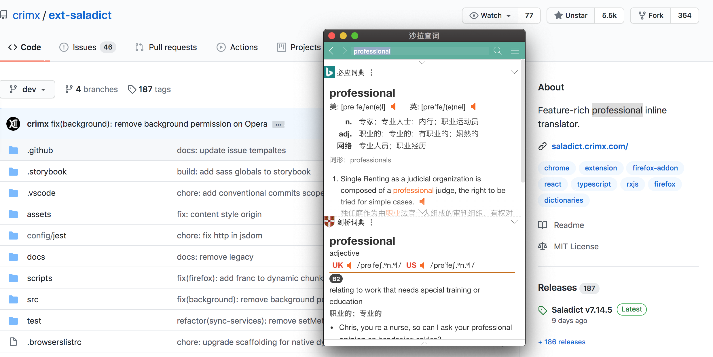
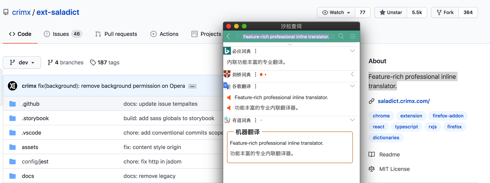
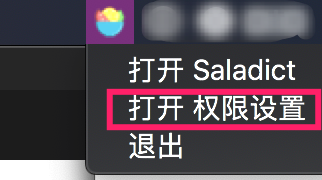
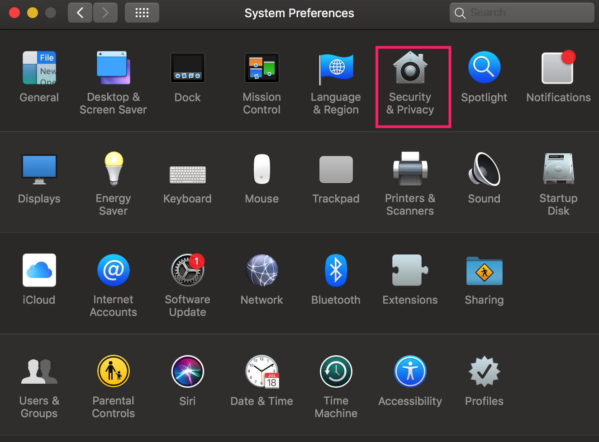
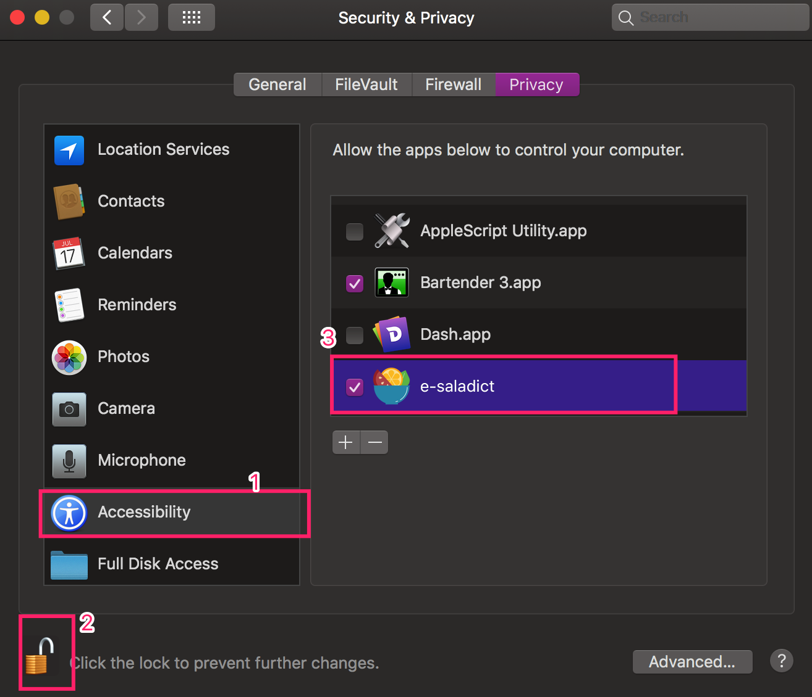
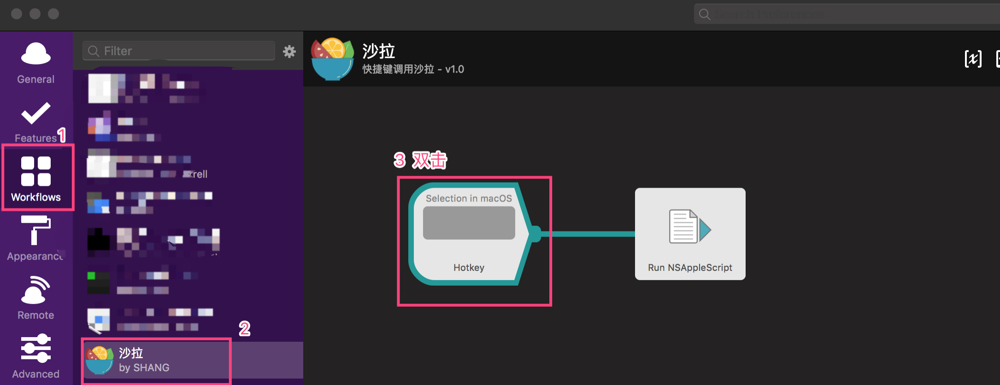

# e-saladict

一个使用 `electron` 打包的 [沙拉词典](https://github.com/crimx/ext-saladict)

## [下载地址](https://github.com/xinshangshangxin/e-saladict/releases)

[](https://github.com/xinshangshangxin/e-saladict/releases)

## 界面




## Q&A

- 快捷键查词

  > 选中单词或句子, 按`Alt+Control+L`

- 快捷键查词只打开了词典, 但是没有查询选中单词(即复制选中内容失败)(_每次安装都会出现_)

  > 从菜单中 打开权限设置  
  >   
  > 或者 打开系统设置 -> 安全 -> 辅助功能
  >   
  > 勾选 `e-saladict`([如果已经勾选, 先取消再勾选, 如果找不到, 请手动添加](https://github.com/octalmage/robotjs/issues/535))
  > 

- 原理

  > 参考了[issues/827](https://github.com/crimx/ext-saladict/issues/827), 使用了[webextensions-emulator](https://github.com/crimx/webextensions-emulator)模拟 chrome extension 环境, electron 开启 `webSecurity: false` 允许跨域访问

- 配合 alfred 快捷键查词

  > 下载 [Workflow](./assets/e-saladict.alfredworkflow), 双击后导入, 打开 `Workflow` 设置快捷键
  > 

- 出现卡顿

  > 开启了 `辅助功能` 导致的, 待后续调查  
  > 如果 配合 alfred 快捷键查词, 可以在`辅助功能`中关闭权限避免卡顿

- 没有 Windows 版本, 只有 Mac 版本吗?

  > 当前代码理论上可以构建, 但由于没有测试环境, 无法确认, 欢迎 PR

## 本地开发

```bash
# clone 本项目
git clone https://github.com/xinshangshangxin/e-saladict.git
# 安装本项目依赖
npm install
npm run rebuild

# clone WebextensionsEmulator 源码
git clone https://github.com/crimx/webextensions-emulator.git
# 替换 WebextensionsEmulator 以适配 ext-saladict
node pre-build/index.js WebextensionsEmulator
# 构建 WebextensionsEmulator
cd webextensions-emulator
npm install
npm run build
cd ..

# clone 沙拉词典源码
git clone https://github.com/crimx/ext-saladict.git
# 构建沙拉词典
cd ext-saladict
# 原作者是用 yarn, 这边不能使用 npm install
yarn
npm run build
cd ..

# 组合 saladict 和 WebextensionsEmulator
rm -rf ext-saladict/build/chrome/mock
mkdir -p ext-saladict/build/chrome/mock
cp webextensions-emulator/dist/** ext-saladict/build/chrome/mock
node pre-build/index.js

# 启动本地 electron
npm start
```

## Thanks

[沙拉词典](https://github.com/crimx/ext-saladict)  
[不安装浏览器也可以使用沙拉查词](https://github.com/crimx/ext-saladict/issues/827)  
[webextensions-emulator](https://github.com/crimx/webextensions-emulator)
